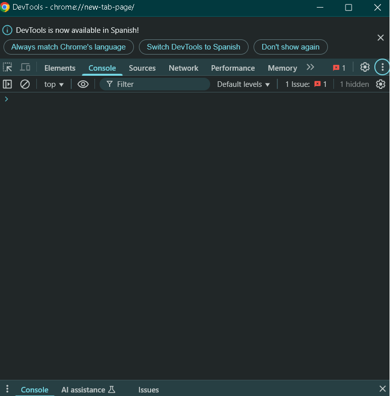
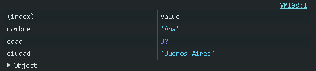
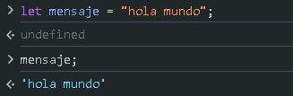

# Introducción a la Consola del Navegador.

La consola del navegador es una herramienta de desarrollo que permite ejecurtar código JavaScript, depurar errores y analizar el comportamiento de una página web en tiempo real.


<hr>

## ¿Cómo abrir la consola del navegador?

La forma de abrir la consola varía según el navegador:

- Google Chrome:
    - Presiona `F12` o `Ctrl + Shift + I`.
    - Luego, ve a la pestaña **Consol**.



<br>

## Ejecutar código en la consola.

Puedes escribir código JavaScript directamente en la consola y presionar `Enter` para ejecutarlo.

*Ejemplo simple:*
```JavaScript
    console.log("Hola desde la consola.");
```

Esto imprimirá `Hola desde la consola` en la consola del navegador.

## Comandos útiles en la consola.

- `console.log(valor)`→ Muestra información en la Consola.
- `console.error("Error!")`→  Muestra un mensaje de error.
- `console.warn("Advertencia!")` →  Muestra una advertencia.
- `console.table(array o objeto)`→  Muestra datos en formato tabla.
- `clear()`→ Limpia la consola.

*Ejemplo con `console.table`*:
```JavaScript
let persona = {nombre: "Ana", edad: 30, ciudad: "Buenos Aires"};
console.table(persona);
```


## Inspección de Variables.

Si declaras una variable en la consola, puedes consultarla después:

```JavaScript
let mensaje = "Hola mundo";
mensaje;
```

